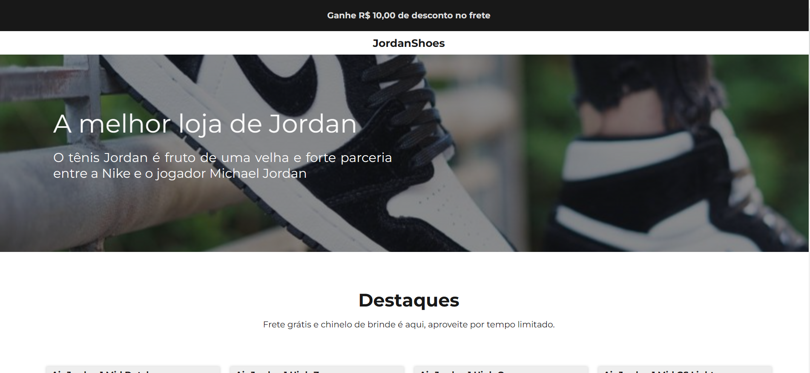
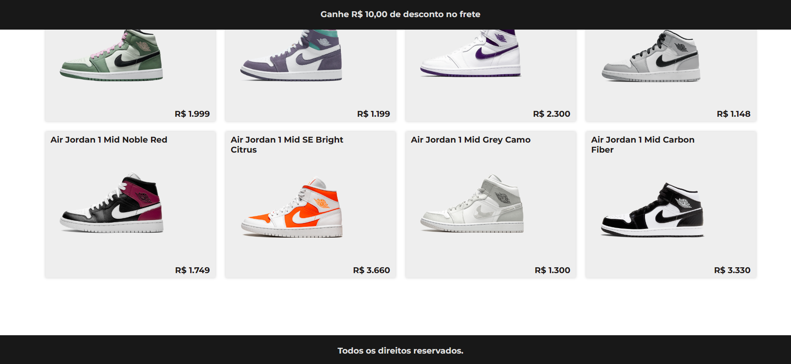
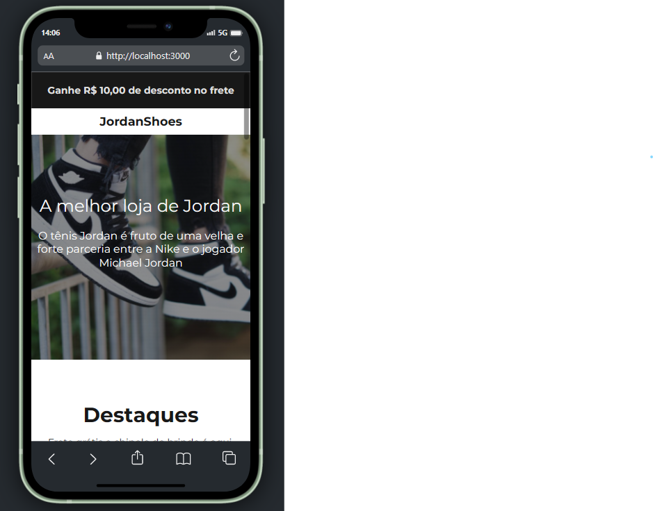
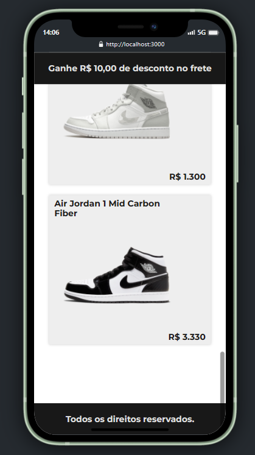

<h1 align="center"> 
	Desafio Codelândia 2
</h1>

## 💻 Sobre o projeto


Projeto foi feito com o intuito de colocar em prática os meus conhecimentos utilizando React

O proejto do figma é um dos projetos disponíveis no servidor do discord Codelândia.

Link da demo: https://63b745cd55b7ef2303491ae1--jade-banoffee-f6ec41.netlify.app/ <br>
Link do servidor: https://discord.gg/wNCWTVuxyz <br>
Link do figma:  https://www.figma.com/file/Yb9IBH56g7T1hdIyZ3BMNO/Desafios---Codel%C3%A2ndia?node-id=1883%3A2&t=bt0doQvURyNtgPyR-0

---
<br>

## 💻 Demosntração
  <br><br>
  <br><br>
  <br><br>
  
  

---

## 🚀 Como executar o projeto

### Pré-requisitos
Antes de tudo, é preciso cerfiticar-se que você tenha instalado na sua máquina as seguintes ferramentas: 
[Git](https://git-scm.com), [Node.js](https://nodejs.org/en/) e um editor de código. Sugiro: [VSCode](https://code.visualstudio.com/)

#### 🎲 Início

```bash
# Clone este repositório
$ git clone https://github.com/ndluz/desafio-codelandia-1.git
# Instale as dependências
$ npm install
# Inicialize com
$ npm start
```

---
